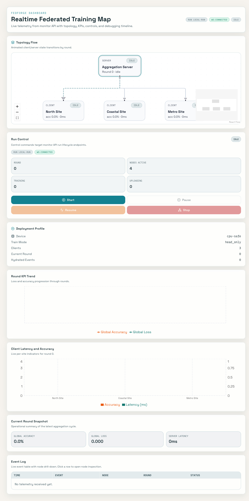

# FedForge

FedForge is a local-first federated learning proof-of-concept that uses:
- Flower for orchestration
- Hugging Face Transformers `Trainer` for client-side training loops
- MedMNIST datasets (BloodMNIST, DermaMNIST, PathMNIST)
- FastAPI + SQLite monitor service for telemetry/control
- Vite + React + TypeScript + Tailwind + shadcn dashboard for realtime topology/status visualization

## What This Repo Demonstrates

- End-to-end FL rounds on a laptop CPU (with optional MPS mode + CPU fallback policy)
- Domain-relevant medical imaging datasets cached inside this repo (`data/medmnist`)
- Deterministic phase profiles for three datasets (baseline + extension phases)
- Live node telemetry, run-state controls, and dashboard visualization
- Analysis outputs and convergence notebook artifacts

## Architecture

```text
                     +-------------------------------+
                     |       Dashboard (Vite)        |
                     |  Realtime topology + controls |
                     +---------------+---------------+
                                     |
                                     | REST + WebSocket
                                     v
+-------------------+      +-------------------------------+
| Flower Server     |----->| Monitor API (FastAPI + SQLite)|
| src.server.app    |      | src.monitor.app               |
+---------+---------+      +-------------------------------+
          ^
          | Flower RPC
          |
+---------+---------+   +---------+---------+   +---------+---------+
| Flower Client 1   |   | Flower Client 2   |   | Flower Client 3   |
| HF Trainer loop   |   | HF Trainer loop   |   | HF Trainer loop   |
+-------------------+   +-------------------+   +-------------------+
```

## Repo Layout

- `src/ml`: dataset prep, preprocessing, training config, trainer/device resolution
- `src/server`: Flower server strategy + round artifact writer
- `src/client`: HF Flower client + simulation runner
- `src/monitor`: telemetry ingest/store/ws/control API
- `apps/dashboard`: TypeScript mini-app for realtime monitoring
- `configs/training`: dataset manifests (A/B/C phases)
- `configs/profiles`: CPU-safe run profiles
- `scripts`: setup, validation, smoke, profile, and orchestration commands
- `data/medmnist`: local dataset cache (`*.npz`)
- `artifacts`: generated metrics, checkpoints, db, analysis outputs

## Prerequisites

- Python `3.11+`
- Node `20+` and npm
- Docker + Docker Compose (for full-stack demo)

## Setup

```bash
python -m venv .venv
source .venv/bin/activate
python -m pip install --upgrade pip
python -m pip install -e ".[dev]"
```

## Dataset Cache (Local to Repo)

Cache all MedMNIST datasets directly under `data/medmnist`:

```bash
python scripts/prepare_medmnist.py --dataset all --root data/medmnist --image-size 28
```

Optional validation + pipeline artifacts:

```bash
python scripts/audit_medmnist.py --dataset all --root data/medmnist --image-size 28
python scripts/partition_medmnist.py --dataset all --root data/medmnist --split train --num-clients 3 --preset moderate --image-size 28 --output-dir artifacts/partitions
python scripts/preprocess_medmnist.py --dataset all --root data/medmnist --image-size 28 --model-id facebook/deit-tiny-patch16-224 --output-dir artifacts/preprocessed --metadata-dir artifacts/preprocess-metadata
```

Current local footprint:

```bash
du -sh data artifacts
```

## CPU-Safe Phase Profiles

Run deterministic profile checks (baseline + extensions):

```bash
python scripts/run_phase_profile.py --profile configs/profiles/bloodmnist_baseline.yaml
python scripts/run_phase_profile.py --profile configs/profiles/dermamnist_extension.yaml
python scripts/run_phase_profile.py --profile configs/profiles/pathmnist_extension.yaml
```

Validate CPU and optional MPS behavior:

```bash
python scripts/validate_hardware_modes.py --dataset all
```

## Simulation and Test Commands

```bash
make lint
make test
make sim-smoke
```

Single-process FL simulation:

```bash
python scripts/run_simulation.py --dataset bloodmnist --device cpu --rounds 1 --num-clients 2 --train-examples-per-client 4 --eval-examples 2
```

## Full Docker Demo (Recommended)

```bash
docker compose up -d --build
```

Services:

- Dashboard: `http://127.0.0.1:5173`
- Monitor API: `http://127.0.0.1:8090`
- Monitor health: `http://127.0.0.1:8090/health`

Trigger run-state controls manually:

```bash
curl -X POST http://127.0.0.1:8090/control/start  -H 'content-type: application/json' -d '{"run_id":"local-run"}'
curl -X POST http://127.0.0.1:8090/control/pause  -H 'content-type: application/json' -d '{"run_id":"local-run"}'
curl -X POST http://127.0.0.1:8090/control/resume -H 'content-type: application/json' -d '{"run_id":"local-run"}'
curl -X POST http://127.0.0.1:8090/control/stop   -H 'content-type: application/json' -d '{"run_id":"local-run"}'
```

Run Docker E2E smoke:

```bash
make docker-smoke
```

Stop stack:

```bash
docker compose down
```

## Analysis Notebook

Execute notebook code cells without Jupyter:

```bash
python scripts/execute_notebook.py notebooks/convergence_analysis.ipynb
```

## Dashboard Screenshots

### Topology + KPI Overview


### Node Detail View



## Troubleshooting

- Port already in use:
  - `lsof -i :5173`
  - `lsof -i :8090`
  - Stop conflicting process/container, then rerun `docker compose up -d`.
- Dashboard shows `ws:error`:
  - Confirm monitor is healthy: `curl http://127.0.0.1:8090/health`
  - Confirm Vite proxy path works: `curl http://127.0.0.1:5173/monitor/health`
  - Recreate dashboard service: `docker compose up -d --force-recreate dashboard`
- Clean slate for monitor state:
  - `rm -f artifacts/monitor/monitor.db`
  - `docker compose up -d --force-recreate monitor-api`
- CPU-only mode for laptop safety:
  - Use `--device cpu` in script commands.
  - Profile configs in `configs/profiles/*.yaml` are CPU-tuned defaults.

## Planning and Execution Doc

- Implementation plan and two-engineer commit chunks: `IMPLEMENTATION_PLAN.md`
- Release readiness checklist and gate evidence: `docs/release-readiness.md`
